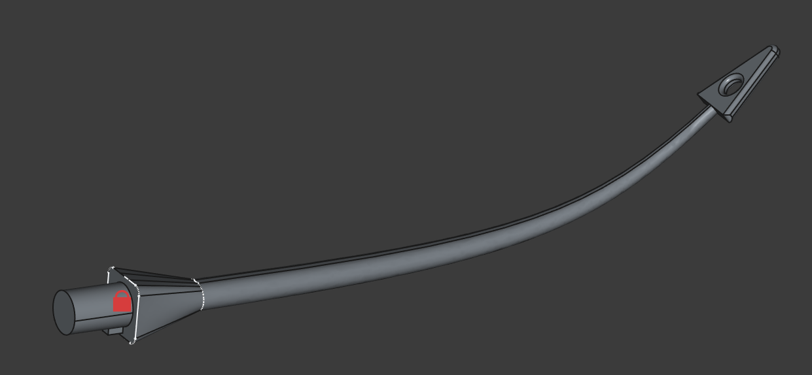

# ABU

3D-models for ice fishing rod "ABU Pimpel 2"

 

# Directory structure
*src/*

Contains src-files (for FreeCAD).

*printables/*

Contains ready to print 3D-models.

# Software
The 3D-models were created with FreeCAD version 1.0.0 (which support Assemblies).

